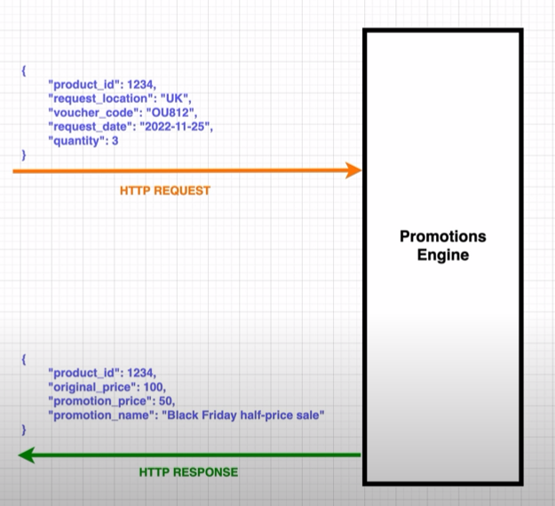

# Promotions Engine Microservice

The aim of the project is build a demo microservice in Symfony.

## Design

The promotion engine has a bunch of affiliate marketing partners that are able to provide discounts on products.

The client application or service can fire a request to the Promotions Engine with various pieces of data.
The engine will then find the best value offerings based on the data it received.



Database design


See `SQL` folder for database data.

### Project setup

Requires docker installed locally.

From the root folder of the project type

```shell
docker-compose up -d
```

Docker will take care of auto-installing dependencies,
creating the database schema, running the migrations and fixtures.
It usually takes few minutes after the `webserver` container is running to complete these tasks.

### Testing the endpoint

You can run the unit tests with

```shell
bin/phpunit tests/unit
```

To test manually you can use postman or similar http client to run a query such as the following

```text
POST http://localhost:8000/products/1/lowest-price
Accept: application/json
Content-Type: application/json

{
  "product_id": 1,
  "quantity": 5,
  "request_location": "UK",
  "voucher_code": "OU812",
  "request_date": "2022-11-27"
}
```

Expected response

```text
{
  "quantity": 5,
  "request_location": "UK",
  "voucher_code": "OU812",
  "request_date": "2022-11-27",
  "promotion_id": 1,
  "promotion_name": "Black Friday half price sale",
  "discounted_price": 250
}
```
